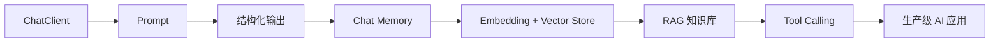

<div align="center">


# Spring AI Tutorial

### 用 Java / Spring Boot 构建真正能运行的 AI 应用

从第一次调用大模型开始，逐步掌握 Prompt、结构化输出、Memory、RAG、Tool Calling 与生产级实践。

<p>
  <a href="https://github.com/arronLu-nio/spring-ai-tutorial/stargazers"></a>
  <a href="https://github.com/arronLu-nio/spring-ai-tutorial/network/members"></a>
  <a href="https://github.com/arronLu-nio/spring-ai-tutorial/actions"></a>
  
  
</p>

<p>
  <a href="#-快速开始">快速开始</a> ·
  <a href="#-学习路线">学习路线</a> ·
  <a href="#-章节目录">章节目录</a> ·
  <a href="#-参与共建">参与共建</a>
</p>

</div>

## ✨ 这个项目适合谁？

如果你会 Java 和 Spring Boot，但不知道如何把大模型接入真实业务，这个教程就是为你准备的。

- 每章围绕一个核心能力展开
- 每个示例都尽量保持小而完整、可以直接运行
- 代码、原理、练习同步推进
- 从 Demo 一直走到企业级 AI 应用

## 🧭 学习路线



## 🚀 快速开始

### 环境要求

- Java 21+
- Maven 3.9+
- Spring Boot 4.0.x
- Spring AI 2.0.0
- 一个 OpenAI 兼容接口的 API Key

### 运行项目

```bash
git clone https://github.com/arronLu-nio/spring-ai-tutorial.git
cd spring-ai-tutorial

export OPENAI_API_KEY="your-api-key"
mvn spring-boot:run
```

调用第一个 AI 接口：

```bash
curl "http://localhost:8080/ai/chat?message=用一句话介绍 Spring AI"
```

## 📚 章节目录

| 章节 | 主题 | 核心内容 | 状态 |
|---|---|---|:---:|
| [01-chatclient](./01-chatclient) | ChatClient 入门 | 调用大模型、构建响应 | ✅ |
| 02-prompt | Prompt 工程 | System Prompt、模板、参数 | 🚧 |
| 03-structured-output | 结构化输出 | JSON、Java Bean、结果校验 | 🚧 |
| 04-chat-memory | 多轮对话 | 会话历史、Memory、上下文 | 🚧 |
| 05-rag | RAG 知识库 | 文档切分、Embedding、向量检索 | 🚧 |
| 06-tool-calling | Tool Calling | 让模型调用业务 API | 🚧 |
| 07-observability | 可观测性 | 日志、指标、Token 成本 | 🚧 |

## 🧩 第一个示例做了什么？

```text
用户问题
   │
   ▼
Spring Web Controller
   │
   ▼
ChatClient.prompt()
   │
   ▼
Chat Model
   │
   ▼
AI 回复
```

核心代码只有几行：

```java
return chatClient.prompt()
        .user(message)
        .call()
        .content();
```

## 📝 每章都会包含

- **知识点**：这一章解决什么问题
- **最小示例**：可以直接复制运行的代码
- **原理说明**：理解 Spring AI 背后的调用链
- **常见问题**：配置、异常和调试方法
- **动手练习**：把示例改造成自己的功能

## 🛠️ 技术栈

`Java 21` · `Spring Boot 4` · `Spring AI 2` · `Maven` · `OpenAI Compatible API`

后续会加入 `PostgreSQL`、`PGVector`、`Redis`、`Docker` 和更多模型提供商。

## 🌟 支持项目

如果这个教程对你有帮助，欢迎点一个 Star。你的反馈会帮助这个项目持续更新更多实战章节。

## 🤝 参与共建

欢迎提交 Issue、补充示例或改进文档：

1. Fork 本项目
2. 创建你的功能分支
3. 提交修改并发起 Pull Request

## 📄 License

[MIT](./LICENSE)

