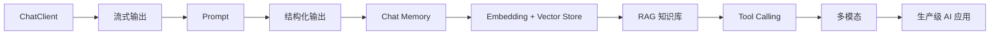

<div align="center">


# Spring AI Tutorial

### 用 Java / Spring Boot 构建真正能运行的 AI 应用

从第一次调用大模型开始，逐步掌握 Prompt、结构化输出、Memory、RAG、Tool Calling 与生产级实践。

<p>
  <a href="https://github.com/arronLu-nio/spring-ai-tutorial/stargazers"></a>
  <a href="https://github.com/arronLu-nio/spring-ai-tutorial/network/members"></a>
  <a href="https://github.com/arronLu-nio/spring-ai-tutorial/actions"></a>
  
  
</p>

<p>
  <a href="#-快速开始">快速开始</a> ·
  <a href="#-学习路线">学习路线</a> ·
  <a href="#-章节目录">章节目录</a> ·
  <a href="#-参与共建">参与共建</a>
</p>

</div>

## ✨ 这个项目适合谁？

如果你会 Java 和 Spring Boot，但不知道如何把大模型接入真实业务，这个教程就是为你准备的。

- 每章围绕一个核心能力展开
- 每个示例都尽量保持小而完整、可以直接运行
- 代码、原理、练习同步推进
- 从 Demo 一直走到企业级 AI 应用

## 🧭 学习路线



## 🚀 快速开始

### 环境要求

- Java 21+
- Maven 3.9+
- Spring Boot 4.0.x
- Spring AI 2.0.0
- 一个 DeepSeek API Key

### 运行项目

```bash
git clone https://github.com/arronLu-nio/spring-ai-tutorial.git
cd spring-ai-tutorial

export RAG_DEEPSEEK_API_BASE="https://api.deepseek.com"
export RAG_DEEPSEEK_API_KEY="your-deepseek-api-key"
export RAG_DEEPSEEK_MODEL="deepseek-v4-flash"
mvn spring-boot:run
```

### 调用接口

启动后也可以直接打开浏览器页面：

```text
http://localhost:8080
```

页面可以选择普通流式聊天或第二章的 Prompt 教师模式。

服务端会在开发环境打印 ChatClient 发给模型的 Prompt 和模型返回的响应，日志级别配置在 `application.yml` 中。

如果要运行 RAG 章节，还需要启动本地 Milvus 和 OpenSearch，并配置 DashScope Embedding：

```bash
export RAG_EMBEDDING_API_BASE="你的 DashScope 兼容接口地址"
export RAG_EMBEDDING_API_KEY="你的 DashScope Key"
export RAG_EMBEDDING_MODEL="text-embedding-v4"
export RAG_EMBEDDING_DIMENSIONS="1024"
export RAG_MILVUS_CHUNKS_COLLECTION="rag_tutorial_chunks"
export RAG_OPENSEARCH_INDEX="rag_tutorial_chunks"
```

RAG 页面：

```text
http://localhost:8080/rag.html
```

完整配置、启动检查和常见问题见 [`05-rag/README.md`](./05-rag/README.md)。

也可以使用命令行调用：

同步返回完整结果：

```bash
curl "http://localhost:8080/ai/chat?message=用一句话介绍 Spring AI"
```

流式返回结果：

```bash
curl -N "http://localhost:8080/ai/chat/stream?message=用三句话介绍 Spring AI"
```

## 📚 章节目录

| 章节 | 主题 | 核心知识点 | 状态 |
|---|---|---|:---:|
| [01-chatclient](./01-chatclient) | ChatClient 入门 | 同步调用、流式输出、SSE、异常处理 | ✅ |
| [02-prompt](./02-prompt) | Prompt 工程 | `system()`、`user()`、模板、Few-shot、约束 | ✅ |
| [03-structured-output](./03-structured-output) | 结构化输出 | JSON、Java Bean、`entity()`、异常处理、字段校验 | ✅ |
| [04-chat-memory](./04-chat-memory) | 多轮对话 | Memory、会话 ID、窗口管理、Redis | ✅ |
| [05-rag](./05-rag) | RAG 知识库 | Tika、Embedding、Milvus、OpenSearch、混合检索、Rerank、引用和评估 | ✅ |
| [06-production-rag](./06-production-rag) | RAG 进阶 | 多轮上下文、缓存、超时、重试、降级、版本管理 | 🚧 |
| [07-tool-calling](./07-tool-calling) | Tool Calling | `@Tool`、工具调用链、ToolMessage、权限校验 | ✅ |
| 08-multimodal | 多模态 | 图片、音频、文本转语音、模型切换 | 🚧 |
| 09-ai-engineering | AI 工程化 | 缓存、限流、重试、成本和安全 | 🚧 |
| 10-production-project | 综合项目 | 知识库助手、Docker、部署与监控 | 🚧 |

## 🧩 第一章：从同步到流式

```text
用户问题
   │
   ▼
Spring Web Controller
   │
   ├── ChatClient.call()   → 一次性返回完整答案
   │
   └── ChatClient.stream() → Flux 分段返回 → SSE 实时推送
```

同步调用：

```java
return chatClient.prompt()       // 创建模型请求
        .user(message)           // 设置用户消息
        .call()                  // 同步等待完整结果
        .content();              // 提取完整文本
```

流式调用：

```java
return chatClient.prompt()       // 创建模型请求
        .user(message)           // 设置用户消息
        .stream()                // 流式返回模型生成内容
        .content();              // 得到 Flux<String>
```

## 📝 每章都会包含

- **知识点**：这一章解决什么问题
- **最小示例**：可以直接复制运行的代码
- **原理说明**：理解 Spring AI 背后的调用链
- **常见问题**：配置、异常和调试方法
- **动手练习**：把示例改造成自己的功能

## 🛠️ 技术栈

`Java 21` · `Spring Boot 4` · `Spring AI 2` · `Maven` · `DeepSeek` · `Milvus` · `OpenSearch` · `Redis`

后续会加入更完整的生产级 RAG、权限过滤、评测、Docker 部署和更多模型提供商。

> 本项目通过 Spring AI 的 OpenAI 兼容接口接入 DeepSeek。API Key 仅从环境变量读取，请勿提交到 Git。

## 🌟 支持项目

如果这个教程对你有帮助，欢迎点一个 Star。你的反馈会帮助这个项目持续更新更多实战章节。

## 🤝 参与共建

欢迎提交 Issue、补充示例或改进文档：

1. Fork 本项目
2. 创建你的功能分支
3. 提交修改并发起 Pull Request

## 📄 License

[MIT](./LICENSE)
